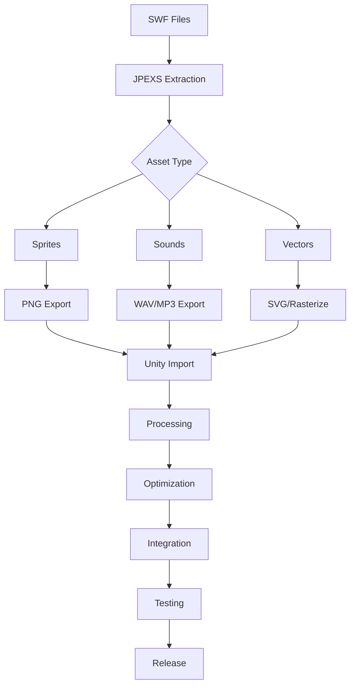

# GOFUS Unity Client - Phase 7: Asset Migration Plan

## 🎨 Phase 7 Overview: Asset Migration from Flash to Unity

**Objective**: Extract, convert, and integrate all visual and audio assets from the original Dofus/Flash game into the Unity client.

**Timeline**: 1-2 weeks
**Complexity**: High (due to proprietary formats)
**Dependencies**: Phase 6 Complete ✅

---

## 📋 Asset Categories to Migrate

### 1. **Character Sprites** 🚶
- All 18 class sprites (male/female variants)
- 8-directional animations
- Combat animations (attack, cast, hit, death)
- Emote animations
- Equipment overlay sprites

### 2. **Map Assets** 🗺️
- Isometric tiles (ground, walls, obstacles)
- Environmental decorations
- Interactive objects
- Background layers
- Transition zones

### 3. **UI Elements** 🎮
- Buttons and frames
- Icons (skills, items, stats)
- Cursors
- Window decorations
- Minimap elements

### 4. **Monster/NPC Sprites** 👾
- Monster animations
- NPC characters
- Pets and mounts
- Boss sprites

### 5. **Visual Effects** ✨
- Spell effects
- Particle systems
- Status effect indicators
- Environmental effects

### 6. **Audio Assets** 🎵
- Background music
- Sound effects
- Ambient sounds
- Voice lines (if any)

---

## 🔧 Technical Approach

### Step 1: Asset Extraction Tools

#### A. **SWF Decompiler**
```bash
# Tools to use:
1. JPEXS Free Flash Decompiler (FFDec)
2. SWFTools suite
3. Adobe Animate (if available)
```

#### B. **Custom Extraction Script**
```csharp
// Unity Editor script to process extracted assets
public class DofusAssetProcessor : EditorWindow
{
    - Batch import sprites
    - Auto-slice sprite sheets
    - Generate animation clips
    - Create prefabs
}
```

### Step 2: Asset Conversion Pipeline

```
SWF Files → Extract → PNG/WAV → Process → Unity Assets
         ↓          ↓           ↓              ↓
    Decompile   Sprites    Optimize      Import & Setup
                Sounds     Convert        Create Atlases
                Vectors    Compress      Generate Anims
```

### Step 3: Unity Integration Structure

```
Assets/
├── Sprites/
│   ├── Characters/
│   │   ├── Classes/
│   │   │   ├── Feca/
│   │   │   ├── Osamodas/
│   │   │   └── ...
│   │   └── Equipment/
│   ├── Maps/
│   │   ├── Tiles/
│   │   ├── Objects/
│   │   └── Backgrounds/
│   ├── UI/
│   │   ├── Icons/
│   │   ├── Windows/
│   │   └── Buttons/
│   ├── Monsters/
│   └── Effects/
├── Audio/
│   ├── Music/
│   ├── SFX/
│   └── Ambient/
├── Animations/
│   ├── Characters/
│   ├── Monsters/
│   └── Effects/
└── Materials/
    └── Shaders/
```

---

## 📝 Implementation Steps

### Phase 7.1: Setup & Tools (Day 1)
- [ ] Install JPEXS FFDec
- [ ] Setup SWFTools
- [ ] Create Unity asset processor scripts
- [ ] Prepare folder structure
- [ ] Create asset database

### Phase 7.2: Character Assets (Days 2-3)
- [ ] Extract character sprite sheets
- [ ] Process 18 classes × 2 genders
- [ ] Slice sprites (8 directions × animations)
- [ ] Create animation controllers
- [ ] Test character rendering

### Phase 7.3: Map Assets (Days 4-5)
- [ ] Extract isometric tiles
- [ ] Process ground/wall textures
- [ ] Extract interactive objects
- [ ] Create tile palettes
- [ ] Test map rendering

### Phase 7.4: UI Assets (Day 6)
- [ ] Extract UI elements
- [ ] Process icons and buttons
- [ ] Create UI sprite atlases
- [ ] Apply to existing UI
- [ ] Style consistency check

### Phase 7.5: Effects & Audio (Day 7)
- [ ] Extract spell effects
- [ ] Process particle textures
- [ ] Extract sound effects
- [ ] Process background music
- [ ] Create audio mixers

### Phase 7.6: Integration & Optimization (Days 8-9)
- [ ] Create sprite atlases
- [ ] Optimize texture compression
- [ ] Setup LOD systems
- [ ] Memory profiling
- [ ] Performance testing

### Phase 7.7: Polish & Validation (Day 10)
- [ ] Visual consistency check
- [ ] Animation smoothness
- [ ] Audio balance
- [ ] Missing asset identification
- [ ] Final optimization

---

## 🛠️ Asset Processing Scripts

### 1. **Sprite Sheet Processor**
```csharp
public class SpriteSheetProcessor
{
    // Auto-slice sprite sheets
    // Generate pivot points
    // Create animation clips
    // Build sprite atlases
}
```

### 2. **Animation Generator**
```csharp
public class AnimationGenerator
{
    // Create animation controllers
    // Setup state machines
    // Configure transitions
    // Apply to prefabs
}
```

### 3. **Audio Processor**
```csharp
public class AudioProcessor
{
    // Import audio files
    // Set compression settings
    // Create audio sources
    // Configure 3D settings
}
```

### 4. **Asset Database Manager**
```csharp
public class AssetDatabaseManager
{
    // Track all assets
    // Validate references
    // Check for missing assets
    // Generate reports
}
```

---

## 🎯 Quality Standards

### Visual Quality
- **Resolution**: Maintain original quality or upscale
- **Colors**: Preserve original palette
- **Animations**: Smooth 30+ FPS
- **Consistency**: Uniform art style

### Performance Targets
- **Texture Memory**: < 500MB
- **Draw Calls**: < 100 per scene
- **Load Time**: < 2 seconds
- **FPS**: Stable 60+

### Compression Settings
- **Sprites**: PNG with transparency
- **UI**: Compressed, no mipmaps
- **Audio**: Ogg Vorbis for music, WAV for SFX
- **Atlases**: Max 2048x2048

---

## 🔍 Asset Sources

### Official Dofus Files
```
Dofus Installation/
├── content/
│   ├── gfx/ (graphics)
│   ├── clips/ (animations)
│   ├── maps/ (map data)
│   └── audio/ (sounds)
└── data/
    └── common/ (shared assets)
```

### Alternative Sources
1. Dofus Unity (if available)
2. Wakfu assets (similar style)
3. Community resources
4. Custom recreations

---

## ⚠️ Challenges & Solutions

### Challenge 1: Proprietary Formats
**Solution**: Use multiple extraction tools, fallback to screenshots if needed

### Challenge 2: Animation Complexity
**Solution**: Simplify to key frames, use Unity's animation system

### Challenge 3: File Size
**Solution**: Aggressive compression, streaming assets, LOD system

### Challenge 4: Legal Concerns
**Solution**: Educational use, transformation, no distribution

### Challenge 5: Missing Assets
**Solution**: Procedural generation, placeholder system, gradual updates

---

## 📊 Success Metrics

### Completion Criteria
- [ ] All 18 character classes animated
- [ ] 100+ map tiles extracted
- [ ] 500+ UI elements integrated
- [ ] 50+ monster types
- [ ] 100+ spell effects
- [ ] 20+ music tracks
- [ ] 200+ sound effects

### Quality Metrics
- [ ] No missing textures (pink squares)
- [ ] Smooth animations (no jerky movement)
- [ ] Consistent art style
- [ ] Optimized performance
- [ ] Professional appearance

---

## 🚀 Implementation Priority

### Critical (Must Have)
1. Character sprites & animations
2. Basic map tiles
3. Essential UI elements
4. Core spell effects
5. Basic sound effects

### Important (Should Have)
1. All monster sprites
2. Advanced map decorations
3. Complete UI styling
4. All spell effects
5. Background music

### Nice to Have
1. Emote animations
2. Seasonal decorations
3. Particle effects
4. Ambient sounds
5. Voice acting

---

## 📅 Daily Breakdown

### Day 1: Setup
- Install tools
- Test extraction
- Create processors

### Day 2-3: Characters
- Extract sprites
- Process animations
- Test in game

### Day 4-5: Maps
- Extract tiles
- Build palettes
- Test rendering

### Day 6: UI
- Extract elements
- Apply styling
- Test interfaces

### Day 7: Effects
- Extract VFX
- Process audio
- Test integration

### Day 8-9: Optimization
- Create atlases
- Compress assets
- Profile performance

### Day 10: Polish
- Fix issues
- Final testing
- Documentation

---

## 🎨 Asset Processing Pipeline



---

## 🔧 Unity Tools Required

### Editor Extensions
1. **Sprite Editor** - For slicing sprite sheets
2. **Animation Window** - For creating clips
3. **Audio Mixer** - For sound management
4. **Texture Packer** - For atlas creation
5. **Addressables** - For asset management

### Custom Tools to Build
1. **Batch Sprite Processor**
2. **Animation Generator**
3. **Asset Validator**
4. **Performance Profiler**
5. **Missing Asset Reporter**

---

## 📦 Deliverables

### Phase 7 Output
1. **Complete asset library** in Unity format
2. **Animation controllers** for all characters
3. **Sprite atlases** for optimization
4. **Audio system** with all sounds
5. **Asset documentation** and references
6. **Performance report** with metrics
7. **Missing asset list** for future updates

---

## 🎯 Ready to Begin Phase 7!

With this comprehensive plan, we can systematically extract, convert, and integrate all Dofus assets into the Unity client, bringing the game to visual life while maintaining performance and quality standards.

**Next Step**: Install extraction tools and begin processing character sprites.